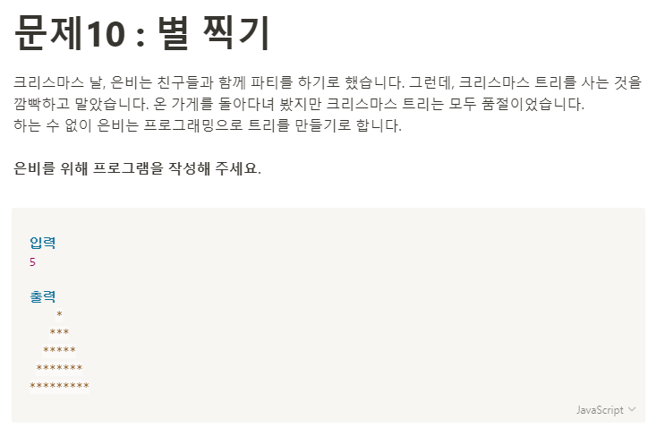

**문제 풀이**



**Solution**

```javascript
const number = 5;
let tree = "";

for (let i = 1; i <= number; i++) {
  let space = "";
  for (let k = 1; k <= number - i; k++) {
    space += " ";
  }
  for (let j = 1; j <= i * 2 - 1; j++) {
    tree += "*";
  }
  tree += space + "\n";
}
console.log(tree);
```
