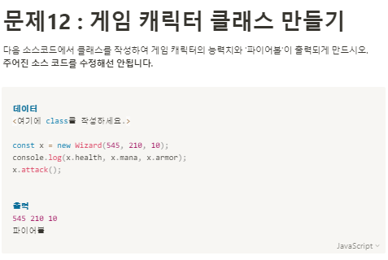

**문제 풀이**



**Solution**

```javascript
class Wizard {
  constructor(health, mana, armor) {
    this.health = health;
    this.mana = mana;
    this.armor = armor;
  }
  attack() {
    console.log("파이어볼");
  }
}

const x = new Wizard(545, 210, 10);
console.log(x.health, x.mana, x.armor);
x.attack();
```
