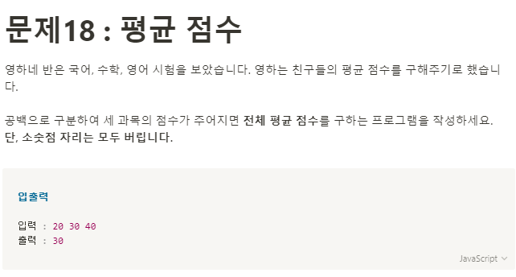

**문제 풀이**



**Solution**

```javascript
const scores = prompt("세 과목의 점수를 입력하세요.").split(" ");
let sum = 0;

const number = scores.map((item) => +item);
sum = number.reduce((acc, cur) => {
  return acc + cur;
}, 0);

console.log(Math.floor(sum / 3));
```
