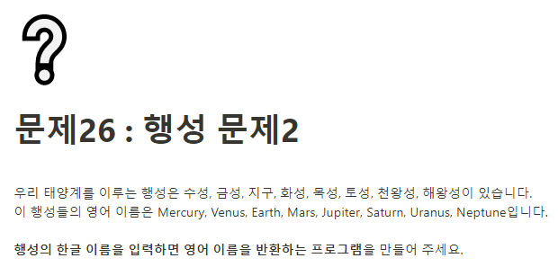

**문제 풀이**



> 객체에 접근할 때 planetKo.whatPlanet을 하게되면 undefined가 뜨는 이유:
> .으로 접근할 경우 키값을 직접적으로 입력해야만 한다.

**Solution**

```javascript
const planetKo = {
  수성: "Mercury",
  금성: "Venus",
  지구: "Earth",
  화성: "Mars",
  목성: "Jupiter",
  토성: "Saturn",
  천왕성: "Uranus",
  해왕성: "Neptune",
};

const whatPlanet = prompt();
console.log(planetKo[whatPlanet]);
```
