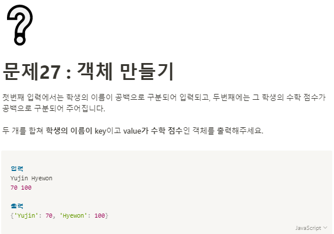

**문제 풀이**



**Solution**

```javascript
const name = prompt().split(" ");
const score = prompt().split(" ");
let obj = {};

for (let i = 0; i < name.length; i++) {
  obj[name[i]] = score[i];
}

console.log(obj);
```
