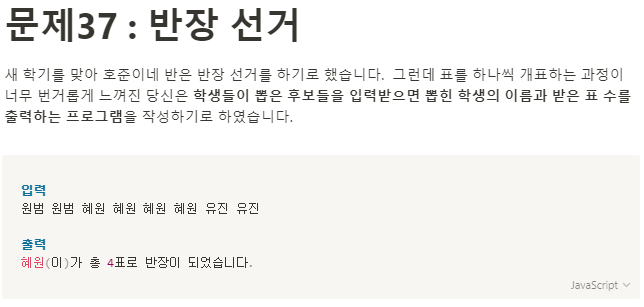

**문제 풀이**



**Solution**

```javascript
const names = "원범 원범 혜원 혜원 혜원 혜원 유진 유진".split(" ");
let res = {};
let winner = "";

for (let idx in names) {
  res[names[idx]] = res[names[idx]] === undefined ? 1 : res[names[idx]] + 1;
}

winner = Object.keys(res).reduce((a, b) => {
  return res[a] > res[b] ? a : b;
});

console.log(`${winner}(이)가 총 4표로 반장이 되었습니다.`);
```
