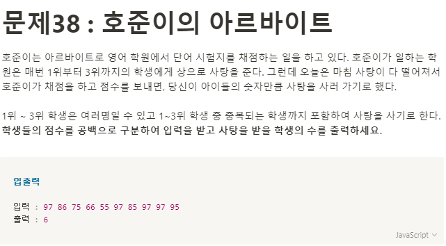

**문제 풀이**



**Solution**

```javascript
const numbers = ["97", "86", "75", "66", "55", "97", "85", "97", "97", "95"];
let res = [];
let count = 0;

numbers.sort();

while (res.length < 3) {
  let val = numbers.pop();
  if (!res.includes(val)) {
    res.push(val);
  }
  count++;
}

console.log(count);
```
