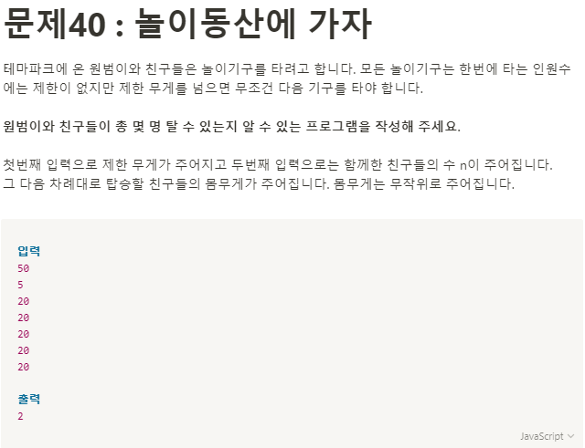

**문제 풀이**



**Solution**

```javascript
let fullWeight = 50;
const human = 5;
const weights = [10, 20, 20, 20, 20];

for (let i = 0; i < human; i++) {
  fullWeight -= weights.shift();
  if (fullWeight < 0) {
    console.log(i);
    break;
  }
}
```
