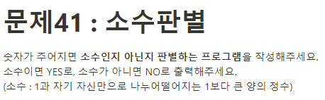

**문제 풀이**



**Solution**

```javascript
const prime = 6;

const primeOrNot = (n) => {
  for (let i = 2; i < n; i++) {
    if (n % i === 0 && n !== 1) {
      console.log("NO");
      return false;
    }
  }
  console.log("YES");
};

primeOrNot(prime);
```
