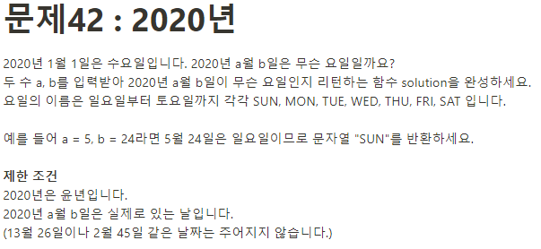

**문제 풀이**



**Solution**

```javascript
const day = ["SUN", "MON", "TUE", "WED", "THU", "FRI", "SAT"];
const month = prompt(),
  date = prompt();

const solution = (month, date) => {
  const thatDay = new Date(`2020-${month}-${date}`);
  return day[thatDay.getDay()];
};

console.log(solution(month, date));
```
