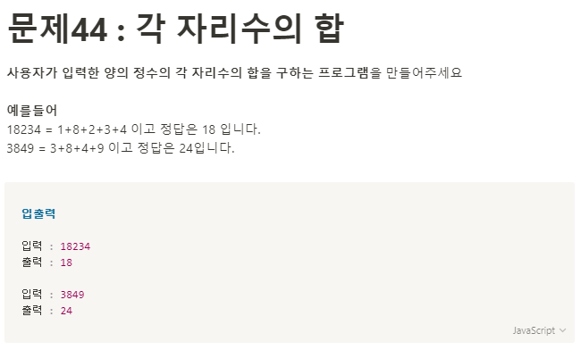

**문제 풀이**



- 10진수를 다른 진수로 변환할때: toString()
- 다른진수를 10진수로 변환할때: parseInt()

**Solution**

```javascript
const number = 3849;
const numberArr = number
  .toString()
  .split("")
  .map((item) => +item);

const res = numberArr.reduce((acc, cur) => {
  return acc + cur;
}, 0);

console.log(res);
```
