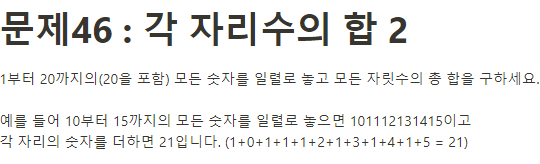

**문제 풀이**



**Solution**

```javascript
let numbers = "";
let sum = 0;

for (let i = 1; i <= 20; i++) {
  numbers += i;
}

sum = numbers.split("").reduce((acc, cur) => {
  return acc + +cur;
}, 0);

console.log(sum);
```
