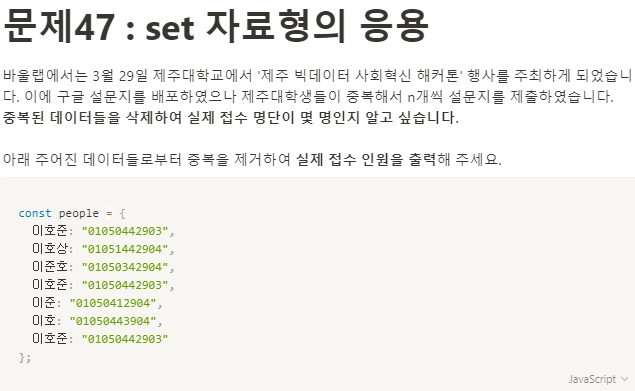

**문제 풀이**



> **Array 중복제거** > https://medium.com/@Dongmin_Jang/javascript-array-%EC%A4%91%EB%B3%B5-%EC%A0%9C%EA%B1%B0%ED%95%98%EB%8A%94-%EB%B0%A9%EB%B2%95-es6-b5b9075361f9

**Solution**

```javascript
const people = {
  이호준: "01050442903",
  이호상: "01051442904",
  이준호: "01050342904",
  이호준: "01050442903",
  이준: "01050412904",
  이호: "01050443904",
  이호준: "01050442903",
};

let res = new Set();
for (let key in people) {
  res.add(key);
}

console.log(res.size);
```
