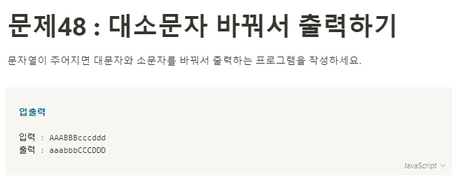

**문제 풀이**



**Solution**

```javascript
let string = "AAABBBcccddd";

let res = string
  .split("")
  .map((item) => {
    return item.toUpperCase() === item
      ? item.toLowerCase()
      : item.toUpperCase();
  })
  .join("");

console.log(res);
```
