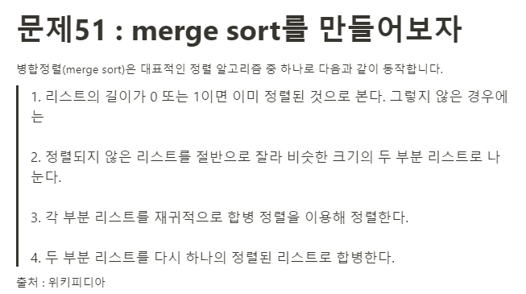

**문제**



**Solution**

```javascript
function mergeSort(arr) {
  if (arr.length <= 1) {
    return arr;
  }

  const mid = Math.floor(arr.length / 2);
  const left = arr.slice(0, mid);
  const right = arr.slice(mid);

  return merge(mergeSort(left), mergeSort(right));
}

function merge(left, right) {
  let result = [];

  // 두 배열이 존재할때까지, 정렬
  while (left.length && right.length) {
    if (left[0] <= right[0]) {
      result.push(left.shift());
    } else {
      result.push(right.shift());
    }
  }

  // left 배열만 남아있을때, 이미 정렬된 상태니 result에 붙여넣기
  while (left.length) {
    result.push(left.shift());
  }
  // right 배열만 남아있을때, 이미 정렬된 상태니 result에 붙여넣기
  while (right.length) {
    result.push(right.shift());
  }

  return result;
}

const array = prompt("배열을 입력하세요")
  .split(" ")
  .map((n) => parseInt(n, 10));

console.log(mergeSort(array));
```
