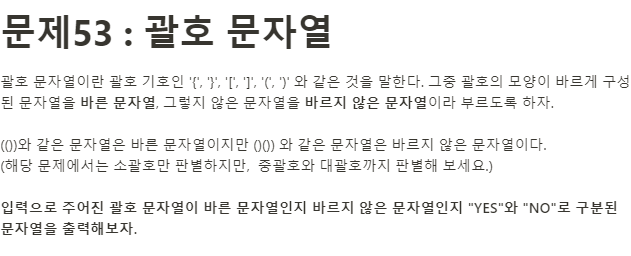

**문제**



**Solution**

```javascript
let count = 0;
let res = [];

const brackets = (bracket) => {
  bracket.map((item) => {
    if (item === "[" || item === "{") item = "(";
    if (item === "]" || item === "}") item = ")";
    return item === "(" ? count++ : count--;
  });

  if (count !== 0) return false;

  for (let key in bracket) {
    if (bracket[key] === "(") {
      res.push("(");
    }

    if (bracket[key] === ")") {
      return res.length === 0 ? false : res.pop();
    }
    return true;
  }
};

let bracket = "{[)".split("");
console.log(brackets(bracket));
```
