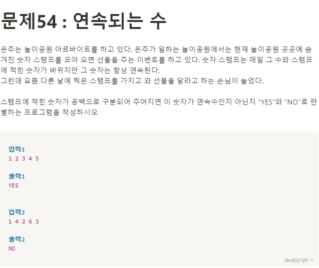

**문제**



**Solution**

```javascript
let number = prompt().split(" ");
let sortNum = [...number].sort();

const res = (numbers) => {
  for (let i = 0; i < numbers.length; i++) {
    if (numbers[i] !== sortNum[i]) return false;
  }
  return true;
};

console.log(res(number));
```
